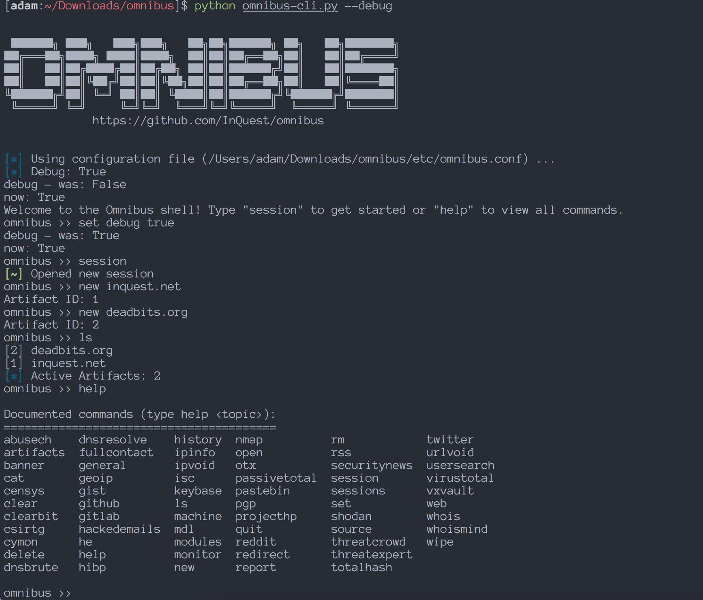

.. _interactive_cli:

Interactive CLI
===============

Overview
--------
Omnibus is controlled through the interactive command line script `omnibus-cli.py`. 

When you first run the CLI, you'll be greeted by a help menu with some basic information. Omnibus tries to use commands that mimic some common Linux commands for familiarity and ease of use. For example, the command ``cat`` to show information about an artifact, ``rm`` to remove an artifact from the database, ``ls`` for view current session artifacts, and output redirection support for any command using the `>` operator.

An example screenshot below shows starting the application with the ``debug`` argument, which I highly recommend in order to get full Python tracebacks on any potential exceptions or crashes, and the basics of viewing commands, creating a session, and adding new artifacts for investigation:

Useful Commands
---------------
The high level commands used in Omnibus most often are:

* ``session``
    * start a new session
* ``new <artifact name>``
    * create a new artifact for investigation
* ``modules``
    * display list of available modules
*   open <file path>
    * load a text file list of artifacts into Omnibus as artifacts
* ``ls``
    * show all active artifacts
* ``rm``
    * remove an artifact from the database
* ``wipe``
    * clear the current artifact session
* ``cat <artifact name | session id>``
    * view beautified JSON database records
* ``<module name> <artifact name | session id>``
    * run a module against an artifact to view & store the results
    * newly discovered artifacts from a modules executed are added as children to the original artifact and created in the database as their own new artifacts
* ``<machine name> <artifact name | session id>``
    * run all modules for an artifacts type against the specified artifact
    * all results are displayed in the output and stored to the database
    * provides an easy method to collect bulk information all at once

Quick Reference
---------------
If you ever need a quick reference on the different commands available for different areas of the application there are sub-help menus for this exact purpose. Using these commands will show you only those commands available relevant to a specific area:

* ``general``
    * overall commands such as help, history, quit, set, clear, banner, etc.
* ``artifacts``
    * display commands specific to artifacts and their management
* ``sessions``
    * display helpful commands around managing sessions
* ``modules``
    * show a list of all available modules

Return to Homepage
------------------
Click here to return to main documentation page: `a home`_.

.. a home: https://omnibus.readthedocs.io/en/master
